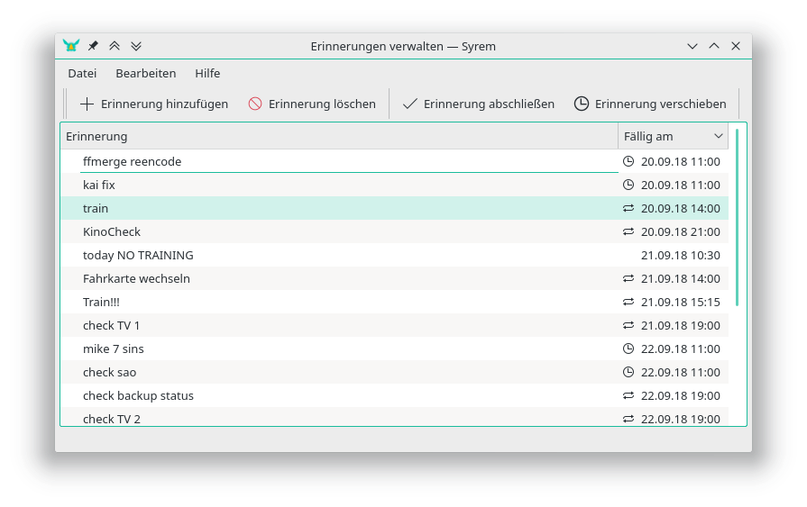
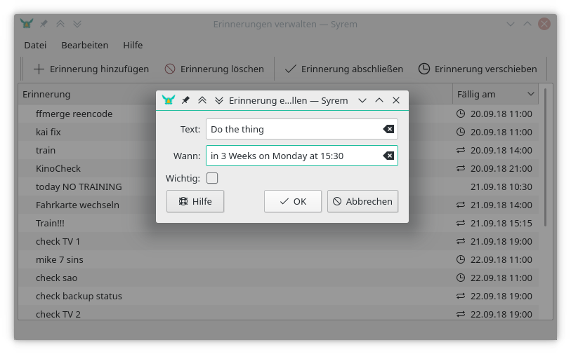
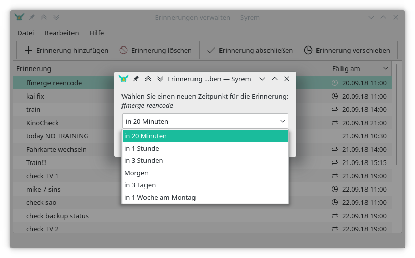
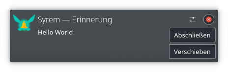
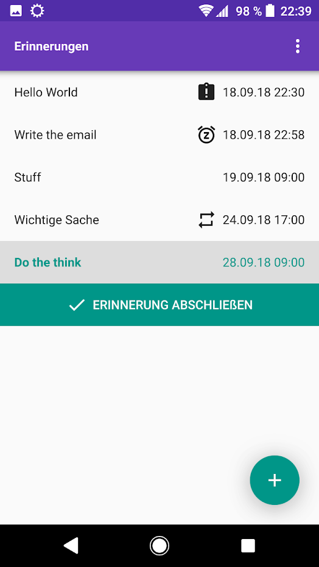
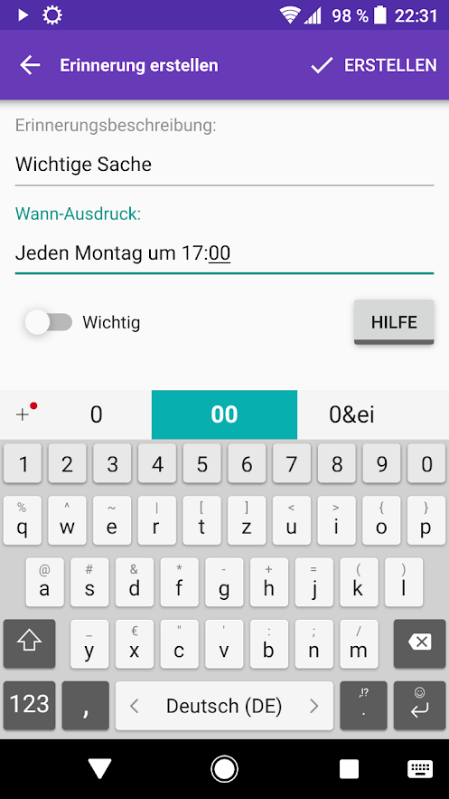
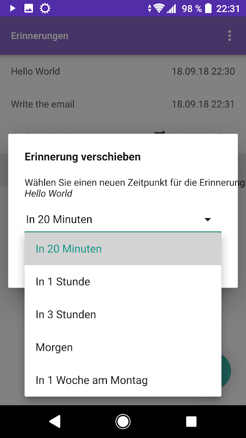
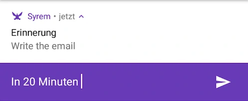

# Syrem - Synchronized Reminders
A simple reminder application for desktop and mobile, with synchronized reminders

## Features
- Create reminders from natural expressions like "in 3 weeks on Monday"
	- supports repeated reminders
	- works with timepoints and timespans
	- make reminders important for persistant notifications
- Allows you to synchronize your reminders between different platforms
	- Currently Linux, Android, Windows and MacOs are supported
	- Available for any linux distro via [flatpak](https://flatpak.org/). See installation below
- Native notification support on linux and android

## Screenshots
### Desktop
| Overview | Add Reminders
|----------|---------------
|  | 
| Snooze Reminders | Notifications (on KDE Desktop)
|  | 

### Mobile
| Overview | Add Reminders | Snooze Reminders
|----------|---------------|------------------
|  |  | 
| | Notifications |
| |  |

## Installation
1. **Arch Linux:** Use the AUR-Package: [`syrem`](https://aur.archlinux.org/packages/syrem/)
2. **Other Linux distributions:** Install via [flatpak](https://flatpak.org/): `sudo flatpak install 'https://raw.githubusercontent.com/Skycoder42/Syrem/master/flatpak/de.skycoder42.syrem.flatpakref'`
	- Flatpak packages work on any linux distribution, as long as you have flatpak installed. See https://flatpak.org/setup/ to get flatpak for your distribution
	- Alternative install method:
		1. Add The repository: `sudo flatpak repo-add skycoder42 'https://raw.githubusercontent.com/Skycoder42/Syrem/master/flatpak/de.skycoder42.flatpakrepo'`
		2. Install: `sudo flatpak install skycoder42 de.skycoder42.syrem`
3. **Android:** While the apk is available as direct download, you can also get it via google play store: [Syrem Google Play](https://play.google.com/store/apps/details?id=de.skycoder42.syrem)
4. **Windows:** Get it via [chocolatey](https://chocolatey.org/): `choco install syrem`
	- See [Syrem - Chocolatey](https://chocolatey.org/packages/syrem/) for package details
	- Chocolatey can be install using the following description: https://chocolatey.org/install#installing-chocolatey
	- You can also install the chocolatey GUI after installing chocolatey itself: `choco install chocolateygui`
5. **MacOs:** Provided via [homebrew cask](https://github.com/Homebrew/homebrew-cask):
	1. First add the tap: `brew tap Skycoder42/qt-modules`
	2. Then install the package: `brew cask install syrem`

## Attributions
### Icon Sources
- Icons from <a href="https://www.flaticon.com/authors/roundicons" title="Roundicons">Roundicons</a> from <a href="https://www.flaticon.com/" title="Flaticon">www.flaticon.com</a> are licensed by <a href="http://creativecommons.org/licenses/by/3.0/" title="Creative Commons BY 3.0" target="_blank">CC 3.0 BY</a>
- http://www.fatcow.com/free-icons
- https://material.io/icons/

### Android libraries
- https://github.com/leolin310148/ShortcutBadger
